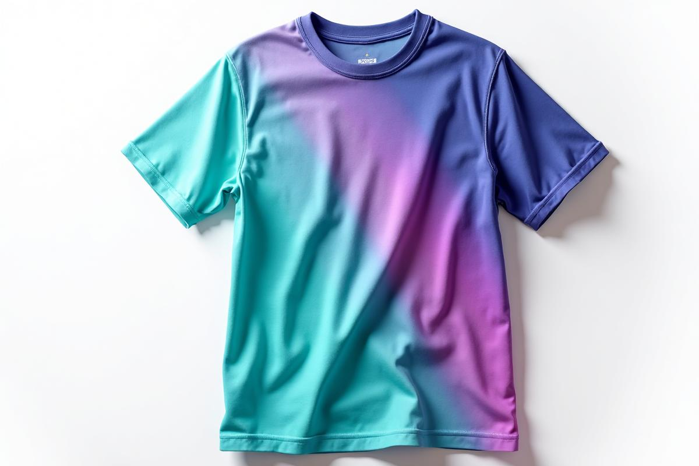

# Styleshop - Custom Clothes Printing E-commerce Platform

A modern, fully-featured e-commerce frontend for custom clothes printing business, built with React, TypeScript, and Tailwind CSS. Features beautiful animations, interactive design tools, and a comprehensive admin dashboard.



## 🚀 Features

### Customer Features
- **Interactive Product Catalog** - Browse and filter products with smooth animations
- **Advanced Mockup Designer** - Upload designs, position, scale, and rotate on products
- **Real-time Preview** - See exactly how designs look on apparel
- **Smart Shopping Cart** - Animated cart with quantity controls and price calculations
- **Responsive Design** - Perfect experience on all devices
- **Beautiful Animations** - Framer Motion powered transitions and microinteractions

### Admin Features
- **Comprehensive Dashboard** - Revenue, orders, products and customer analytics
- **Order Management** - Track and update order statuses
- **Product Management** - Add, edit, and manage inventory
- **Analytics & Reports** - Visual charts and performance metrics
- **Real-time Stats** - Live business metrics and KPIs

### Technical Features
- **Modern React** - Functional components with hooks
- **TypeScript** - Full type safety and better developer experience
- **Tailwind CSS** - Custom design system with unique color palette
- **Framer Motion** - Smooth animations and page transitions
- **Responsive Design** - Mobile-first approach
- **Component Architecture** - Modular, reusable components
- **Design System** - Consistent styling with semantic tokens

## 🎨 Design System

### Color Palette
- **Primary Gradient**: Minty Cyan (#0ed2c2) to Electric Violet (#5a3dff)
- **Accent**: Vibrant Pink (#ff7ab6)
- **Neutral Dark**: Near-black Navy (#0f1724)
- **Neutral Light**: Light Background (#f7f9fc)
- **Success**: Teal (#2dd4bf)
- **Error**: Red (#ff6b6b)

### Typography
- **Headings**: Poppins (bold, eye-catching)
- **Body Text**: Inter (clean, readable)

### Animations
- Page transitions with Framer Motion
- Hover effects and microinteractions
- Product showcase animations
- Cart and form interactions
- Loading states and feedback

## 🛠 Tech Stack

- **Frontend Framework**: React 18 with TypeScript
- **Styling**: Tailwind CSS with custom design system
- **Animations**: Framer Motion + Lottie
- **UI Components**: Shadcn/ui (customized)
- **Routing**: React Router DOM
- **State Management**: React Context + Hooks
- **Icons**: Lucide React
- **Build Tool**: Vite
- **Code Quality**: ESLint + TypeScript

## 📱 Pages & Components

### Pages
1. **Home** (`/`) - Hero section, featured products, design tool demo
2. **Catalog** (`/catalog`) - Product browsing with filters and search
3. **Admin Dashboard** (`/admin`) - Complete business management interface

### Key Components
- **Header** - Navigation with cart and search
- **Footer** - Links, contact info, newsletter signup
- **Hero** - Animated landing section with CTAs
- **ProductShowcase** - Featured products grid
- **FeatureSection** - Service highlights and benefits
- **MockupCanvas** - Interactive design preview tool
- **CartSidebar** - Sliding cart with order summary
- **Admin Components** - Dashboard, orders, products management

## 🎯 User Experience

### Customer Journey
1. **Discovery** - Browse hero section and featured products
2. **Exploration** - Use catalog filters to find desired products
3. **Customization** - Upload design and use mockup tool
4. **Purchase** - Add to cart and proceed to checkout
5. **Tracking** - Monitor order status and history

### Admin Workflow
1. **Overview** - Dashboard with key metrics
2. **Orders** - Process and update order statuses  
3. **Products** - Manage inventory and product details
4. **Analytics** - Review performance and trends

## 🚀 Getting Started

### Prerequisites
- Node.js 18+ and npm
- Modern web browser

### Installation
```bash
# Clone the repository
git clone <YOUR_GIT_URL>

# Navigate to project directory
cd Styleshop

# Install dependencies
npm install

# Start development server
npm run dev
```

### Available Scripts
- `npm run dev` - Start development server
- `npm run build` - Build for production
- `npm run preview` - Preview production build
- `npm run lint` - Run ESLint

## 🔧 Configuration

### Environment Variables
```bash
# .env.local (for local development)
VITE_STRIPE_PUBLISHABLE_KEY=pk_test_...
VITE_API_URL=http://localhost:3001
```

### Customization
- **Colors**: Modify `src/index.css` CSS variables
- **Typography**: Update font imports in `index.html`
- **Components**: Customize in `src/components/ui/`
- **Animations**: Adjust Framer Motion configs

## 📦 Project Structure

```
src/
├── components/
│   ├── Layout/           # Header, Footer
│   ├── Home/            # Hero, ProductShowcase
│   ├── Features/        # FeatureSection
│   ├── MockupDesigner/  # MockupCanvas
│   ├── Cart/            # CartSidebar
│   └── ui/              # Reusable UI components
├── pages/
│   ├── Index.tsx        # Home page
│   ├── Catalog.tsx      # Product catalog
│   ├── AdminDashboard.tsx # Admin interface
│   └── NotFound.tsx     # 404 page
├── assets/              # Images and static files
├── hooks/               # Custom React hooks
├── lib/                 # Utilities and helpers
├── index.css           # Global styles and design system
└── main.tsx            # App entry point
```

## 🎨 Animation Features

### Framer Motion Animations
- **Page Transitions** - Smooth enter/exit animations
- **Product Cards** - Hover effects with lift and shadow
- **Hero Elements** - Staggered animations on load
- **Cart Actions** - Flying animations for add-to-cart
- **Form Interactions** - Focus and validation states

### Microinteractions
- **Button Hovers** - Scale and glow effects
- **Icon Animations** - Rotating and bouncing elements
- **Loading States** - Skeleton screens and spinners
- **Success Feedback** - Confirmation animations

## 🔮 Future Enhancements

### Backend Integration Ready
- API endpoints for products, orders, users
- Authentication with JWT tokens
- Payment processing with Stripe
- File uploads with Cloudinary
- Email notifications

### Recommended Additions
- User authentication and profiles
- Order tracking and history
- Design library and templates
- Bulk ordering for businesses
- Mobile app with React Native
- Advanced analytics dashboard

## 📄 License

This project is licensed under the MIT License - see the LICENSE file for details.

## 🤝 Contributing

1. Fork the repository
2. Create your feature branch (`git checkout -b feature/AmazingFeature`)
3. Commit your changes (`git commit -m 'Add some AmazingFeature'`)
4. Push to the branch (`git push origin feature/AmazingFeature`)
5. Open a Pull Request

## 📞 Support

- **Documentation**: Check this README and inline comments
- **Issues**: Create GitHub issues for bugs or feature requests
- **Community**: Join our Discord for discussions

---

**Styleshop** - Transform your ideas into wearable art! 🎨👕✨